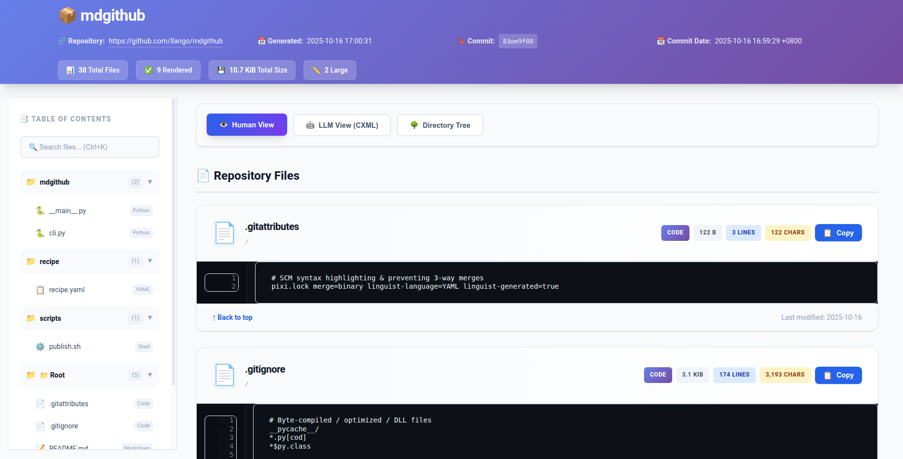

A professional tool to flatten any GitHub repository into a single, beautiful HTML page with enhanced UI/UX.



## ✨ Features

- 👁️ **Human-readable view** with syntax highlighting
- 🤖 **LLM-optimized CXML format** for AI assistants
- 🌳 **Directory tree visualization**
- 🔍 **Real-time search** (Ctrl+K)
- 📋 **One-click copy** functionality
- 🖼️ **Fixed Markdown images** with relative paths
- 📱 **Fully responsive** design

## 🚀 Quick Start

```bash
# Using pixi
pixi run flatten https://github.com/llango/mdgithub

# With custom output
pixi run flatten https://github.com/llango/mdgithub -o output.html

# Don't open browser automatically
pixi run flatten https://github.com/llango/mdgithub --no-browser
```

or

```bash
mdgithub https://github.com/llango/mdgithub

mdgithub https://github.com/llango/mdgithub -o output.html

mdgithub https://github.com/llango/mdgithub --no-browser
```
